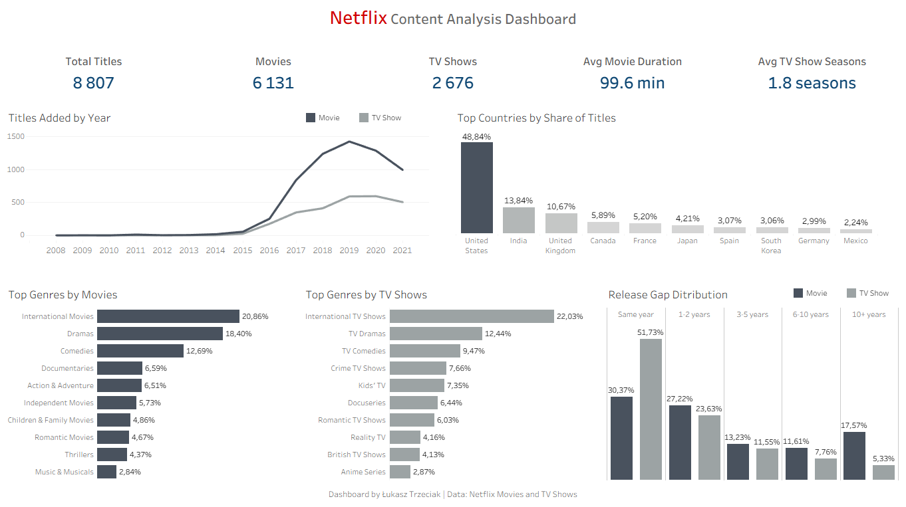

# 🎬 Netflix Content Analysis Dashboard

## 📌 Overview
This project analyzes the **Netflix Movies and TV Shows** dataset using **PostgreSQL** for data cleaning and analysis, and **Tableau Public** for dashboard design.

The main goal was to explore the structure of Netflix’s content library and answer business-style questions related to:
- content growth over time
- Movies vs TV Shows comparison
- country contribution
- genre distribution
- release timing patterns

---

## 🛠️ Tools Used
- **PostgreSQL (pgAdmin 4)** — data cleaning, transformation, and analysis
- **Tableau Public** — dashboard creation and visualization

---

## 📂 Dataset
**Source:** Netflix Movies and TV Shows dataset from Kaggle

Main fields used in the analysis:
- `type`
- `title`
- `country`
- `date_added`
- `release_year`
- `rating`
- `duration`
- `listed_in`

---

## 🔄 Project Workflow
### 1. Data Import
The raw dataset was imported into PostgreSQL for structured analysis.

### 2. Data Cleaning
Several cleaning and transformation steps were performed:
- converted empty strings into `NULL`
- created a cleaned date column: `date_added_clean`
- split `duration` into:
  - numeric value
  - duration unit
- standardized inconsistent values such as `Season` / `Seasons`

### 3. Data Transformation
Multi-value columns required additional transformation:
- `country`
- `listed_in`

These columns were split into separate rows using PostgreSQL functions:
- `STRING_TO_ARRAY()`
- `UNNEST()`
- `TRIM()`

### 4. Analysis
SQL queries were created to answer business-focused questions and generate dashboard-ready outputs.

### 5. Visualization
Final query outputs were exported to CSV and used to build a dashboard in Tableau Public.

---

## ❓ Key Business Questions
- How has Netflix’s content library grown over time?
- What is the balance between Movies and TV Shows?
- Which countries contribute the most content?
- What are the top genres for Movies and TV Shows?
- Are TV Shows added closer to release date than Movies?
- What is the average movie duration and average number of TV Show seasons?

---

## 📊 Key Insights
- Netflix’s library expanded rapidly after **2015**
- **Movies (6,131)** significantly outnumber **TV Shows (2,676)**
- The **United States**, **India**, and the **United Kingdom** contribute the most content
- Movies are dominated by **International Movies**, **Dramas**, and **Comedies**
- TV Shows are dominated by **International TV Shows**, **TV Dramas**, and **TV Comedies**
- TV Shows are added to Netflix closer to their release date than Movies
- **51.73%** of TV Shows were added in the **same year** as release
- Only **30.37%** of Movies were added in the **same year** as release
- Movies contain a larger share of older catalog titles than TV Shows

---

## 🚀 Results
The final dashboard includes:
- **KPI summary**
- **Titles added by year**
- **Top countries by share of titles**
- **Top genres by content type**
- **Release gap distribution for Movies vs TV Shows**

This project demonstrates an end-to-end analytics workflow:
**raw data → cleaning → SQL analysis → visualization**

---

## 🖥️ Dashboard Preview

---

## 🔗 Links
- **Tableau Public:** https://public.tableau.com/app/profile/datainaforest

---

## 📁 Repository Structure
```text
netflix-content-analysis-postgresql-tableau
│
├── README.md
│
├── sql
│   ├── 01_data_exploration.sql
│   ├── 02_data_cleaning.sql
│   └── 03_analysis_for_tableau.sql
│
├── tableau_data
│   ├── kpi_summary.csv
│   ├── titles_by_year.csv
│   ├── country_share_top10.csv
│   ├── genre_share_top10_by_type.csv
│   └── release_gap_pct.csv
│
├── dashboard
│   └── netflix_content_analysis_dashboard.png
│
└── assets
    └── dashboard_preview.png
